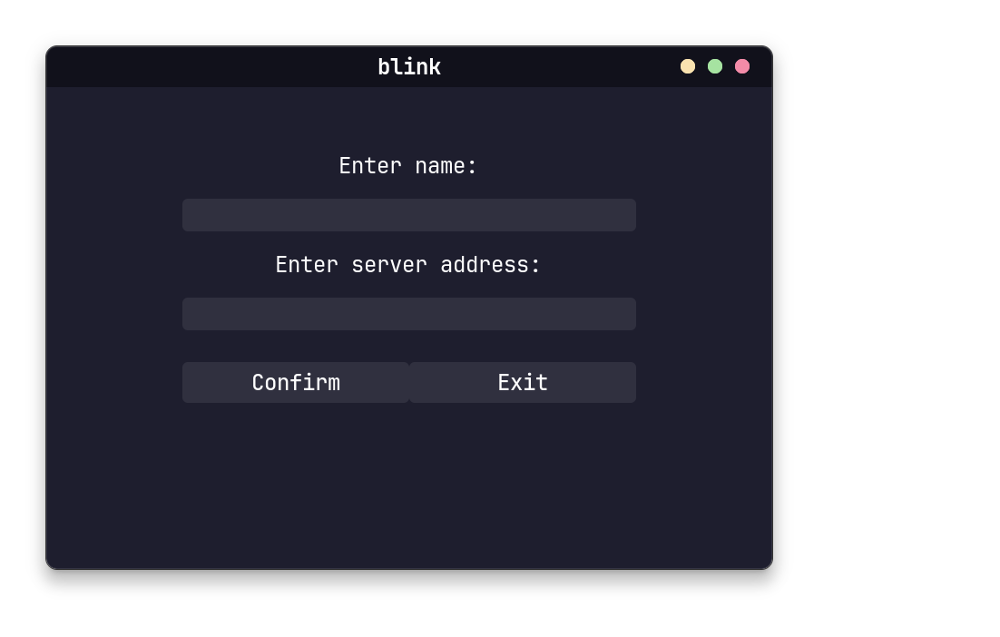
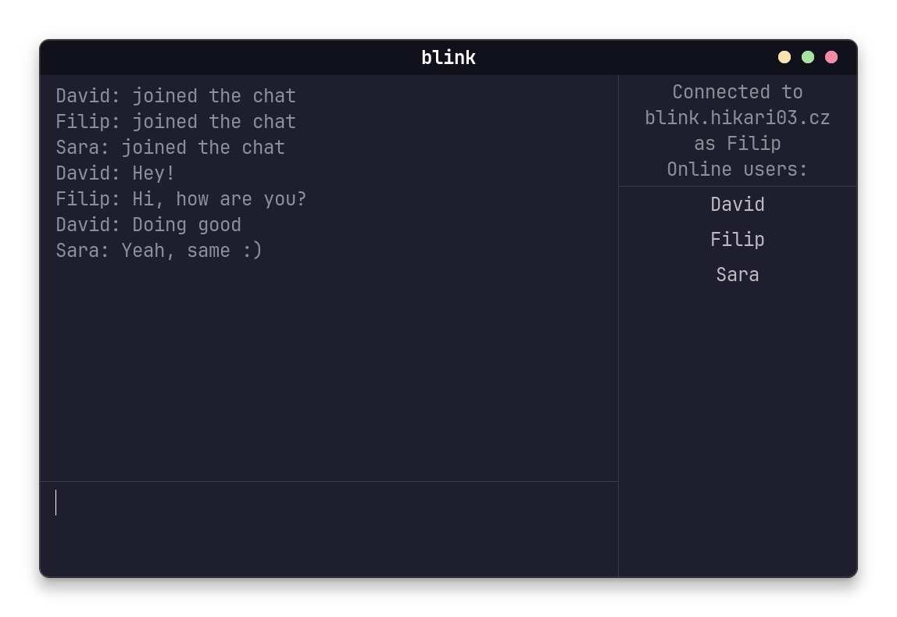

# Blink
### Chat application in gtk4, written purely in C++.


> [!Note]
> If you want to use terminal interface for client and/or want static build, you can use the `ncurses` branch.
## Windows
- See [releases](https://github.com/Hikari03/Blink/releases/latest) for windows build

### Building on Windows
- Windows build is possible using [MSYS2](https://www.msys2.org/) UCRT64
- Run MSYS2 UCRT64 as administrator
- You will need to install following packages:
- `pacman -S git make unzip mingw-w64-ucrt-x86_64-gtkmm-4.0 mingw-w64-ucrt-x86_64-libsodium mingw-w64-ucrt-x86_64-toolchain`
- Hopefully, you will be able to build it with `make win` command in src and consequently `make install_win` to install it

# Linux
## Dependencies
### Shared
- `make`,`libsodium`, `g++` with c++23 support

### Client
- `unzip` and `gtkmm4` for GUI

### Server
- `docker` and `docker-compose` optionally for server

## Client
### Build
``` bash
git clone https://github.com/Hikari03/Blink.git && \
cd Blink/src && \
make && \
make install
```

### Usage
``` bash
blink
```
or launch from your desktop environment as an app

- then follow instructions
- to exit in connected chat, type `/q` and then enter

### Screenshots




## Server
### Use Docker
#### With scripts
You can get the `docker-update-start.sh`, `docker-attach.sh` and `docker-shutdown.sh`.
With them, you can control the server with ease.
- `docker-update-start.sh` will automatically update the image if needed and start the server
- `docker-attach.sh` will attach you to server console. Use `help` to print available commands. When you want to exit console, use `CTRL + P, CTRL + Q`.
- `docker-shutdown.sh` will shutdown the container

#### Manually
- download the docker-compose.yml
- `docker compose up -d` or `docker-compose up -d`
- to control the server use `docker attach blink-server`
- `docker compose down` or `docker-compose down`

### From Source
#### Build
``` bash
git clone https://github.com/Hikari03/Blink.git && \
cd Blink/server && \
make
```
#### Usage: 
in Blink/server
``` bash
./blink-server
```

### Controls
- `help` help
- `q` quit server
- `list` list all connected clients
- `kick <name>` kick out client with name
- `ipban <name>` ban client with name
- `ipunban <name>` unban client with name
- `ipbans` list all banned clients

## Attributions
- <a href="https://www.flaticon.com/free-icons/blink" title="blink icons">Blink icons created by kawalanicon - Flaticon</a>
- <a href="https://github.com/catppuccin/gtk" title="catppuccin theme">Catppuccin mocha mauve theme</a>
- <a href="https://www.msys2.org/" title="MSYS2 dlls">MSYS2 dlls</a>

# TODO

- [x] better resource management
- [x] better server terminal
- [x] fix kicking out users
- [x] sending only last *n* messages so everything is stable
- [x] ability to see online users
- [x] better syncing of chat when someone connects or leaves
  - this is when new user connects and doesn't see the chat history
    or when someone leaves and the chat history is not updated
- [x] fix server having unexpected behavior when closing server with clients connected
- [x] implement code for graceful stop in docker 
- [x] transfer ncurses static build to librender that will make static library
- [x] make communication encrypted
- [x] remake client to use gtkmm4
- [ ] fix duplicate messages that show only sometimes
- [x] port to windows
- [x] make default theme (probably catppuccin)
- [x] [build catppuccin theme](https://github.com/catppuccin/gtk/blob/main/docs/USAGE.md) in makefile and not store it in repo
- [x] make persistent storage for server
- [x] make persistent storage for client
- [x] fix ncurses branch client
- [ ] implement notice when client gets kicked out
